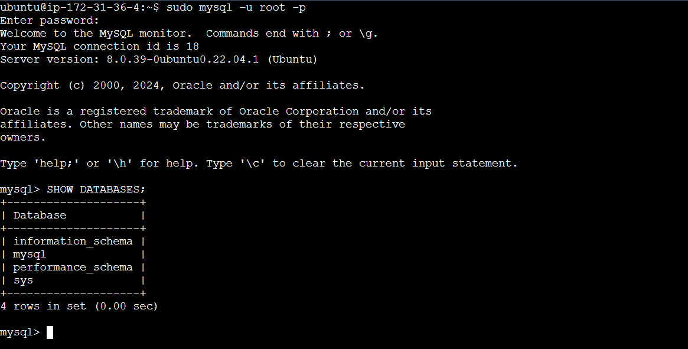

# Server-IAC
Terraform template to provision a virtual machine with a web server and a MySQL database engine

# Prerequisites
- Terraform should be installed
- AWS credentials configured

# Set Up
```bash
git clone git@github.com:JerryAgbesi/Server-IAC.git
```

# Initialize Terraform
```bash
Terraform init
```

- To confirm the resources that will be created:
```bash
Terraform plan
```

# Apply Configuration
```bash
Terraform apply
```

# EC2 instance with MySQL installed


__NB: In order to prevent racking up cost on AWS you need to clean up your account__ 

# Resource clean up
```bash
Terraform destroy
```
